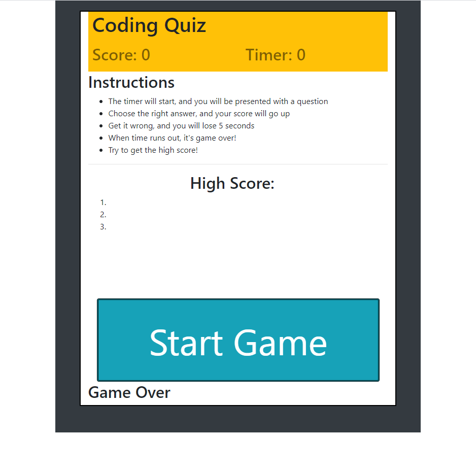

# Javascript Quiz Game

## Introduction
   In this quiz game, you will be asked 10 questions about JavaScript and
   you have only 30 seconds to answer them all. Should you answer incorrectly, you will recieve a 5 second penalty.

### Technologies
Project uses the following languages/frameworks:
* HTML 5
* CSS
* Javascript
* Bootstrap 4

#### Contributing
All coding done by me, Thomas Whittle.

##### Known issues
Here's a few issues I'm working on:
* Occasionally repeats a question twice

* No working high score functionality yet

* Will sometimes display the timer as below zero